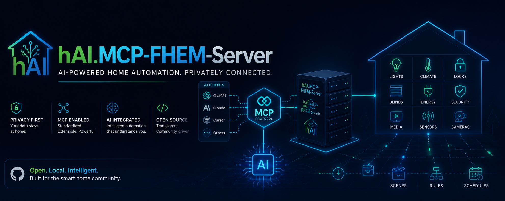

<p align="center">

[](https://www.buymeacoffee.com/highfish)
  
</p>

# hAI.MCP-FHEM-Server 🚀

[](https://opensource.org/licenses/MIT)
[](https://github.com/jbkunama1/hAI.MCP-FHEM-Server/actions/workflows/docker-build-push.yml)
[](https://github.com/jbkunama1/hAI.MCP-FHEM-Server/stargazers)
[](https://github.com/jbkunama1/hAI.MCP-FHEM-Server/issues)

**MCP Servers for Home Automation and IoT Control**

A collection of lightweight, containerized MCP servers for controlling home automation systems like **FHEM**, **Home Assistant**, and more. Designed for **low RAM usage** and easy deployment via **Portainer** or Docker Compose.

---

## 📄 Documentation
- [FHEM Command Reference](FHEM_COMMANDS.md) – Guide for MCP agents to interact with FHEM.

---

## 📦 Features

- **FHEM MCP Server**: Steuert FHEM über das offizielle MCP-Streamable-HTTP-Protokoll.
- **Dockerized**: Ready to deploy with `docker-compose` or Portainer.
- **GitHub Actions**: Automated builds and pushes to **GHCR.io**.
- **MIT License**: Free to use, modify, and distribute.

---

## 🚀 Quick Start

### Deploy with Docker Compose

> **Note**: Both `MCP_API_KEY` and `FHEM_URL` must be set in your environment or `.env` file. The container will fail to start if they are missing.

```yaml
version: '3.8'

services:
  fhem-mcp:
    image: ghcr.io/jbkunama1/hai.mcpservers/fhem-mcp:latest
    container_name: fhem-mcp
    restart: unless-stopped
    environment:
      - MCP_API_KEY=${MCP_API_KEY:?MCP_API_KEY environment variable is required}
      - FHEM_URL=${FHEM_URL:?FHEM_URL environment variable is required}
    ports:
      - "5887:8000"
    networks:
      - highfishNetwork

networks:
  highfishNetwork:
    external: true
```

### Environment Variables

Set the following variables in Portainer:

```ini
MCP_API_KEY=your-secure-random-key-here
FHEM_URL=http://192.168.178.15:8085/fhem
```

### Local Build

For local development, use the `docker-compose.local.yml` file:

```yaml
version: '3.8'

services:
  fhem-mcp:
    build:
      context: ./fhem-mcp
      dockerfile: Dockerfile
    container_name: fhem-mcp
    restart: unless-stopped
    environment:
      - MCP_API_KEY=${MCP_API_KEY:?MCP_API_KEY environment variable is required}
      - FHEM_URL=${FHEM_URL:?FHEM_URL environment variable is required}
    ports:
      - "5887:8000"
    networks:
      - highfishNetwork

networks:
  highfishNetwork:
    external: true
```

Run the local build with:

```bash
docker-compose -f docker-compose.local.yml up --build
```

### Run the Container

```bash
docker-compose up -d
```

---

## 🛠️ Usage

The server implements the **MCP Streamable HTTP** protocol. Connect your MCP client (Copilot, Cursor, Claude Desktop, …) to:

```
http://<host>:5887/mcp
```

with header `X-API-Key: your-secure-random-key-here`.

### Exposed MCP Tools

| Tool | Description |
|------|-------------|
| `fhem_list_devices(name_filter, type_filter)` | List all devices as JSON, optionally filtered by name or type |
| `fhem_device_search(room, type_filter)` | Search devices by room or type |
| `fhem_get(device, reading)` | Read a single reading of a device |
| `fhem_get_readings(device)` | Get all readings of a device |
| `fhem_reading_history(device, reading, start, end)` | Get reading history |
| `fhem_set(device, value)` | Control a device (on/off, temperature, dim, …) |
| `fhem_set_multiple(device, values)` | Set multiple values of a device at once |
| `fhem_define(name, type, def_attr)` | Create a new FHEM device |
| `fhem_attr(device, name, value)` | Set an attribute of a device |
| `fhem_list_attrs(device)` | List all attributes of a device |
| `fhem_delete(name)` | Delete a FHEM device |
| `fhem_command(cmd)` | Execute a raw FHEM command |

Full reference: [FHEM Command Reference](FHEM_COMMANDS.md).

> **Note**: The old REST endpoint `GET /command` was removed in favor of the MCP protocol.

---

## 📂 Repository Structure

```
├── fhem-mcp/
│   ├── Dockerfile          # Lightweight Python 3.10 slim image
│   ├── fhem_mcp.py         # FastMCP server for FHEM (Streamable HTTP)
│   ├── requirements.txt    # Python dependencies
│   └── .env.example        # Example environment variables
├── .github/
│   └── workflows/
│       └── docker-build-push.yml  # GitHub Actions workflow
├── README.md              # This file
├── docker-compose.yml     # Docker Compose for Portainer
├── FHEM_COMMANDS.md       # FHEM command reference for agents
└── LICENSE                 # MIT License
```

---

## 🤝 Contributing

Contributions are welcome! Open an **issue** or submit a **pull request**.

---

## 📜 License

This project is licensed under the **MIT License**. See [LICENSE](LICENSE) for details.

---

## 📬 Contact

For questions or feedback, reach out via [GitHub Issues](https://github.com/jbkunama1/hAI.MCP-FHEM-Server/issues).
